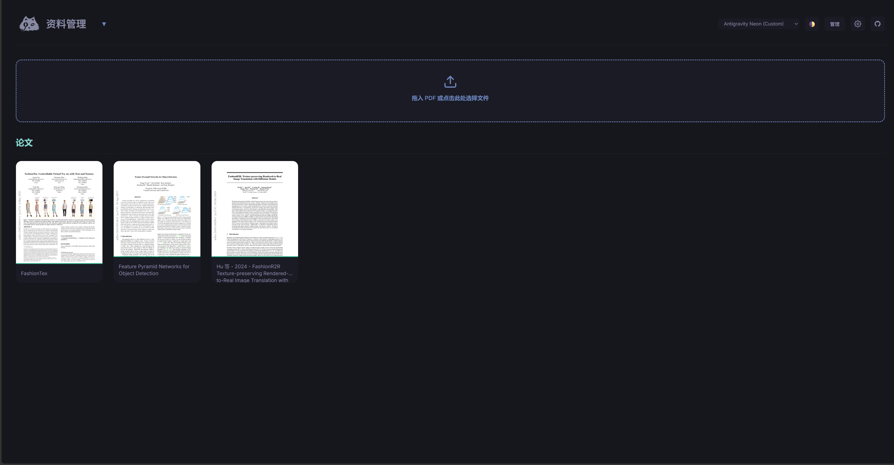
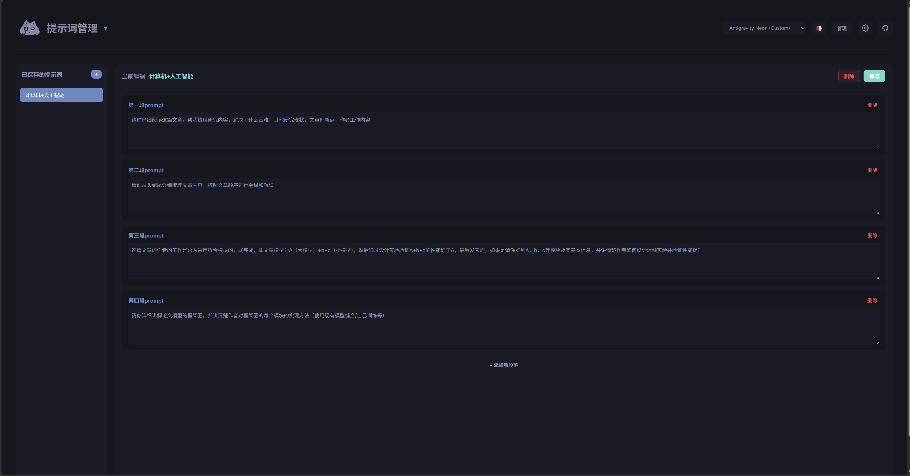
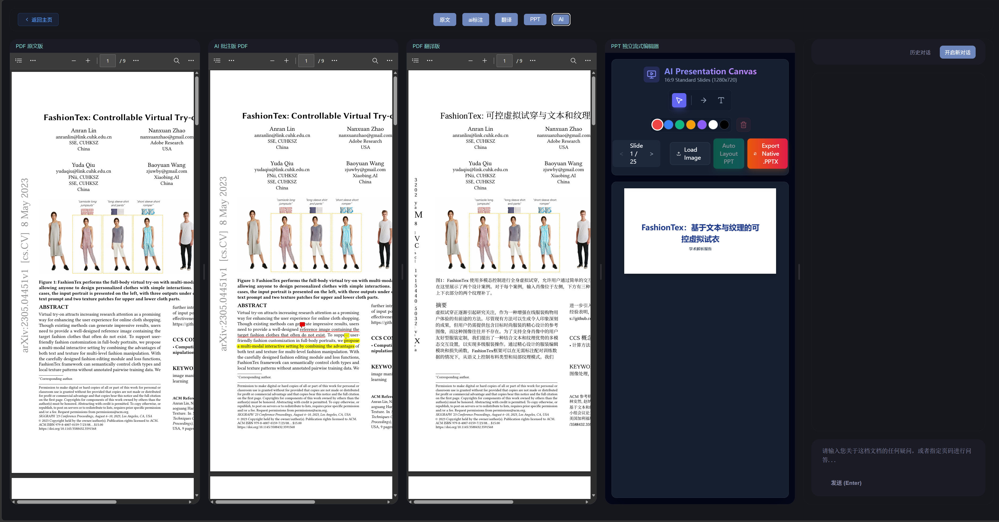

# Paperfect
Paperfect 是一个本地化的 Web 应用，用于将学术教材和论文进行格式化提取、翻译解析以及交互式阅读辅助。它主要结合了视觉大语言模型（VLM）与本地处理逻辑，实现学术文档的知识库化。



## 主要功能

1. **教材解析 (PDF 转 Markdown)**
   采用 VLM 调用（默认使用 SiliconFlow 提供的 Qwen 系列视觉模型）对上传的教材 PDF 进行页面截图并转化为结构化的 Markdown 文本，并保持原有公式、图表和逻辑结构的完整性。支持断点续传与多线程处理。
2. **论文翻译 (中英对照)**
   内部集成官方 `pdf2zh` 包模块，对原始学术论文进行版面解析与双语对照翻译，生成不破坏原版式的新 PDF 文件供下载和阅读。
3. **对话式 RAG 伴读**
   将解析完毕的 Markdown 文本或论文挂载为知识库，提供与文档相关的对话服务，用于辅助阅读理解或归纳总结。
4. **演示文稿自动生成 (PDF2PPT)**
   独立的 PPT Maker 子系统，可将提取完毕的讲义或书籍章节，基于特定的 Prompt 生成大纲并自动排版为配套的 `.pptx` 幻灯片。

## 项目结构

```text
├── imports/                   # 存储导入的教材原始 PDF 及断点缓存目录
├── papers/                    # 存储导入的学术论文及翻译后的结果
├── web_ui/                    # Web 前后端主程序目录
│   ├── main.py                # FastAPI 启动主文件与后端路由
│   ├── static/                # 静态资源文件（如 Logo）
│   └── templates/             # Jinja2 前端页面 (首页及 Chat 页面)
├── standalone_pdf2ppt/        # 基于内容的自动 PPT 生成独立子模块
│   └── ppt_maker/             # 处理逻辑与前端 Vite 工程
├── scratch_scripts/           # 早期的原型算法手稿/杂项实验区
├── tools/                     # 后期封装好的独立脚手架和增强配件
│   ├── upload_github.py       # 本地代码规范检测与一键推送工具
│   ├── paper_translator.py    # 论文双语翻译器 (依赖 pdf2zh)
│   ├── process_xhs_data.py    # 媒体数据挖掘清洗拓展脚本
│   └── pdf_annotator.py       # 用于 PDF 追加高光批注的模块
├── config.template.json       # 开源核心配置模板（使用者需自行更名为 config.json 防止秘钥泄露）
├── universal_kb_builder.py    # VLM 图像识别与知识库并发构建之核心调度流引擎
└── run.bat                    # 双进程一键启动入口 (Windows 环境推荐)
```

## 安装与配置

### 环境要求
- 操作系统：Windows / Linux / macOS (在基于 COM 的 PPT 的重塑阶段推荐使用 Windows)
- Python 3.10 及以上系统环境

### 依赖安装

进入项目根目录并严格按顺序执行以下两步核心命令以完成环境初始化：

**第一步：安装 Python 后端 AI 大脑引擎模块 (必选)**
```bash
pip install -r requirements.txt
```

**第二步：安装前端独立子系统依赖 (必选，用于生成与渲染 PPT)**
```bash
cd standalone_pdf2ppt/ppt_maker
npm install
```

*(注：PPT 的原生导出功能额外依赖系统底层 `win32com`，如果使用 Windows 并调用该特定模块，需要确保系统中已安装好 Microsoft PowerPoint 本体软件。)*

### 配置文件
如果项目根目录下未自动生成 `config.json`，可自行创建，配置如下核心结构（请根据实际持有的 API Key 替换字符串）：

```json
{
    "parse_api_url": "https://api.siliconflow.cn/v1",
    "parse_api_key": [
        "sk-xxx"
    ],
    "parse_model": "Qwen/Qwen3-VL-235B-A22B-Thinking",
    "chat_api_url": "https://api.siliconflow.cn/v1",
    "chat_api_key": "sk-yyy",
    "chat_model": "Qwen/Qwen3-VL-235B-A22B-Thinking",
    "translate_api_key": "sk-zzz"
}
```

## 运行与使用

## 运行与使用

此项目包含纯自研的两大微服务组件 (Python 后端数据解析框架 + Vite 前端 PPT 大视界渲染栈)，因此推荐直接通过我们预置的热启动脚本跑满体验：

- **Windows 用户**：直接双击根目录下的 `run.bat`。系统会并列启动两个命令窗帮您挂起全部进程进行协同。
- **其他平台开发者**：请开启两个终端，分别在根目录执行：
  ```bash
  python web_ui/main.py
  ```
  和
  ```bash
  cd standalone_pdf2ppt/ppt_maker && npm run dev
  ```

## 注意事项

- 在处理几百页的无字化或纯图 PDF 时，程序会在 `imports/` 或 `papers/` 目录下生成切片文件以供多线程分发处理。如果在分析过程中断，重新上传相同文件即可继续进行。
- 为保证安全，项目核心配置文件 `config.json` 已内建置入屏蔽名单 `.gitignore` 进行阻截，以防止密钥或接口 URL 在 Github 部署时造成大面积意外泄露。
