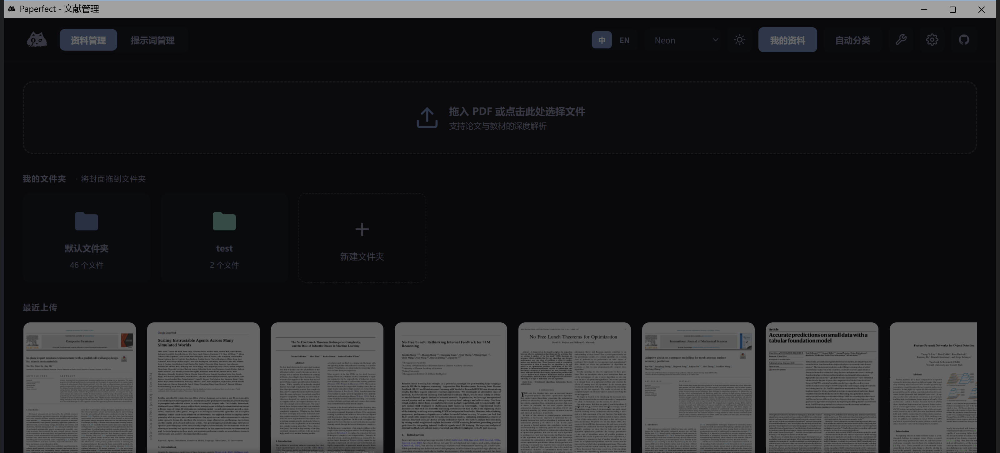
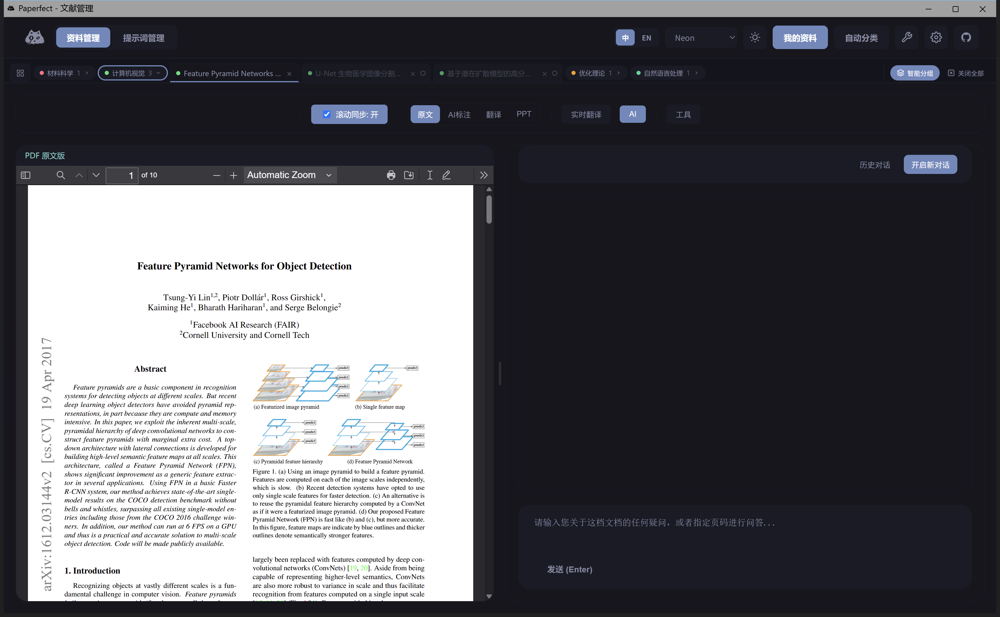
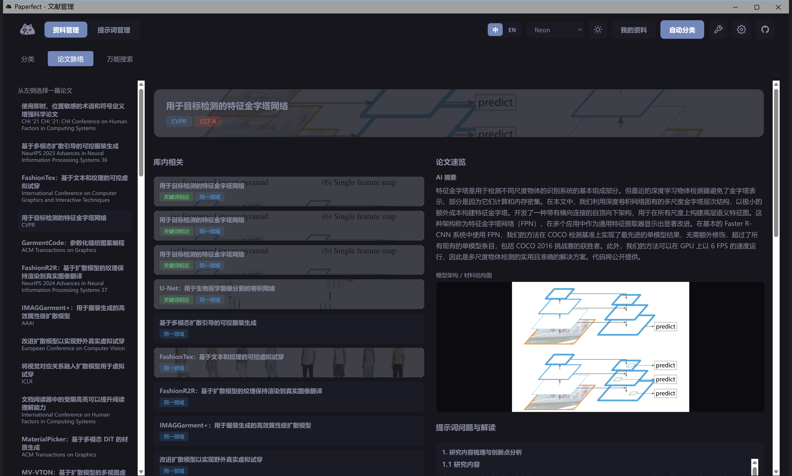
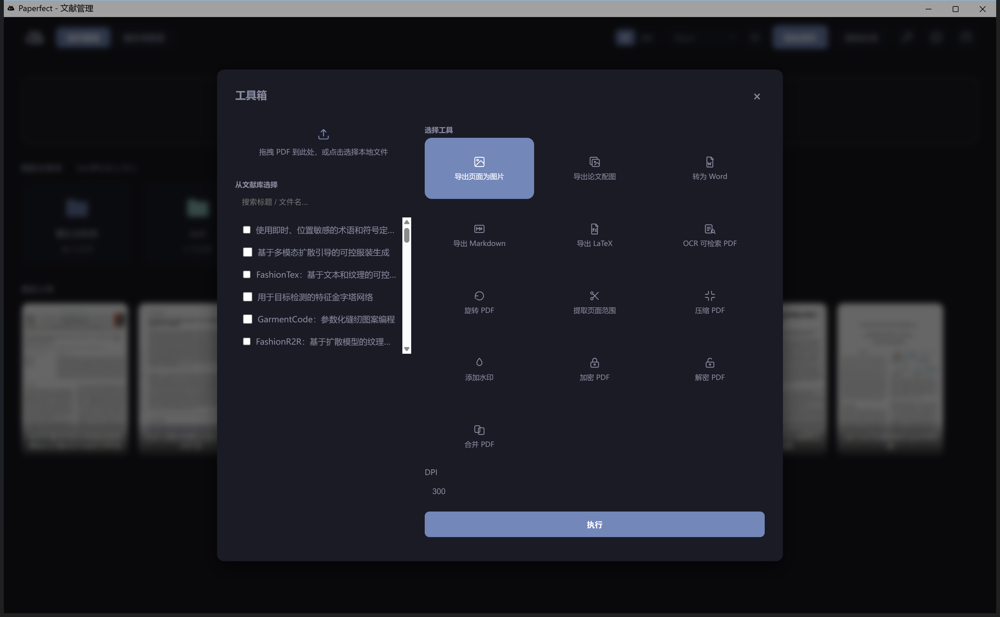

<div align="center">


# Paperfect

**AI 学术阅读助手 · 解析 · 翻译 · 批注 · 生成 PPT · 一站式文献工作台**

[](#-安装与运行)
[](#-技术栈)
[](#-技术栈)
[](#-技术栈)
[](#-安装与运行)
[](#)

一篇论文丢进去，几分钟后拿到：**双语对照译文、四色语义批注、可编辑 PPT、AI 摘要与知识图谱**。

</div>

---

## ✨ 这是什么

Paperfect 是一个本地优先（local‑first）的学术论文阅读与整理工具。上传一篇 PDF，后台流水线会自动完成解析、翻译、语义批注和 PPT 生成，并把结果整理进一个可检索、可问答、按学科自动分组的个人文献库——不需要在五六个不同的网站/软件之间来回倒腾。

<p align="center">
  
  <br/>
  <sub>资料管理首页：拖拽上传、文件夹整理、最近文献一览</sub>
</p>

## 🚀 核心功能

| 功能 | 说明 |
| --- | --- |
| **智能解析** | 基于大模型的 PDF 结构化解析，提取标题、作者、摘要、关键词、期刊/会议、CCF / JCR / 中科院分区，自动识别中文标题 |
| **双语翻译** | 导入即开始后台翻译，生成保留原版式的双语对照 PDF |
| **四色语义批注** | AI 自动标出「贡献」「方法」「问题」「段落大意」四类语义，并写回 PDF，可直接在阅读器里查看 |
| **一键生成 PPT** | 基于论文内容自动生成可编辑的演示文稿，与原文页码双向同步滚动 |
| **论文脉络** | 单篇 AI 摘要卡片：标志性配图做成标题横幅、模型架构图、AI 摘要、逐条提示词问答、库内相关文献推荐 |
| **万能搜索** | 用自然语言在整个文献库里提问，AI 检索并归纳作答，附引用来源 |
| **浏览器式标签阅读** | 多篇论文同时开在标签页里，支持拖拽排序/合并、右键菜单、按学科智能分组、长时间不看自动休眠 |
| **独立工具箱** | 不依赖文献库即可用的 PDF 小工具：导出图片/配图、转 Word / Markdown / LaTeX、OCR、旋转、拆分、压缩、加水印、加密解密、合并 |
| **AI 伴读问答** | 针对当前论文的对话式问答，可指定页码/图表讨论 |
| **多主题 + 中英双语** | Cyan Light / Dark+ / Neon 等配色主题，界面语言可一键切换 |

<p align="center">
  
  <br/>
  <sub>阅读工作区：标签页栏 + 原文/翻译/批注/PPT/AI 任意拼装分栏</sub>
</p>

<table>
<tr>
<td width="50%">
  
  <p align="center"><sub>论文脉络：AI 摘要 + 配图 + 标签化期刊/CCF 分区</sub></p>
</td>
<td width="50%">
  
  <p align="center"><sub>工具箱：拖拽上传 + 一批开箱即用的 PDF 小工具</sub></p>
</td>
</tr>
</table>

## 🧩 技术栈

- **后端**：FastAPI + SQLAlchemy(SQLite)，`PyMuPDF` / `pdf2docx` / `pymupdf4llm` / `pikepdf` / `RapidOCR`+`ocrmypdf` 负责各类 PDF 处理，通过 OpenAI 兼容协议调用大模型
- **前端**：`library.html` 为 Vue 3 + Vue Router 驱动的单页应用（资料库、分类、论文脉络、万能搜索、提示词管理），`chat.html` 作为独立阅读页以 iframe 形式嵌入标签页阅读器，PDF 渲染基于 PDF.js
- **桌面端**：Electron 打包 + PyInstaller 编译后端为单文件可执行程序，NSIS 生成 Windows 安装包
- **PPT 生成**：独立 Node.js 子系统 `backend/standalone_pdf2ppt`

## 📦 安装与运行

### 方式一：直接使用安装包（推荐给普通用户）

从 [Releases](../../releases) 下载最新的 `Paperfect-Setup-*.exe`，双击安装。首次打开后，在右上角齿轮「账户设置」里填入你的 API Key 即可开始使用——服务地址与模型已经预先配置好，不需要手动填。

### 方式二：从源码运行（用于开发）

```bash
git clone https://github.com/waiteddegree608-ship-it/paperfect.git
cd paperfect

python -m venv venv
venv\Scripts\activate          # Windows；macOS/Linux 用 source venv/bin/activate
pip install -r requirements.txt

copy .env.example .env         # macOS/Linux 用 cp .env.example .env
# 编辑 .env，填入你自己的 API Key（服务地址与模型已在代码中固定）

python backend/main.py         # 启动后自带一个原生窗口
# 或者：python backend/main.py --headless，然后浏览器打开 http://127.0.0.1:8900
```

PPT 生成功能依赖 Node.js，首次使用前请在 `backend/standalone_pdf2ppt/ppt_maker` 目录下执行一次 `npm install`。

### 方式三：自行打包桌面版

```bash
python build_portable_exe.py   # 编译便携版可执行文件 -> dist_portable/
python build_installer.py      # 生成 Electron 安装包 -> dist_electron/
```

## 🗂 项目结构

```text
paperfect/
├── backend/                # FastAPI 后端
│   ├── api/                 # 路由：文献库 / 论文 / 对话 / PPT / 工具箱 / 配置
│   ├── services/            # 解析、翻译、批注、PPT、论文脉络、检索等核心逻辑
│   ├── models/               # SQLAlchemy 数据模型
│   └── standalone_pdf2ppt/  # 独立 PDF → PPT 生成子系统（Node.js）
├── frontend/
│   ├── templates/           # library.html（SPA）/ chat.html（阅读器）
│   └── static/              # JS / CSS / 图标资源
├── docs/                   # 用户使用说明书与截图
├── build_installer.py       # 生成 Electron 安装包
├── build_portable_exe.py    # PyInstaller 编译便携版可执行文件
└── requirements.txt
```

## 📖 使用说明书

完整图文教程见 [`docs/Paperfect用户使用说明书.html`](docs/Paperfect用户使用说明书.html)，涵盖安装、账户设置、上传解析、四色批注、PPT 联动、标签页阅读器、工具箱、论文脉络与万能搜索、主题语言、常见问题排查等全部功能。

## ⚠️ 注意事项

- `.env` 中只需要填 API Key，服务地址与模型由程序内部固定，不会读取也不会保存用户自定义的地址/模型
- API Key 只保存在本机 `.env` 文件里，不会被打进安装包或上传到任何服务器
- 处理大文件或多篇文献时建议保持网络稳定；中断后重新上传同一文件可从缓存继续
